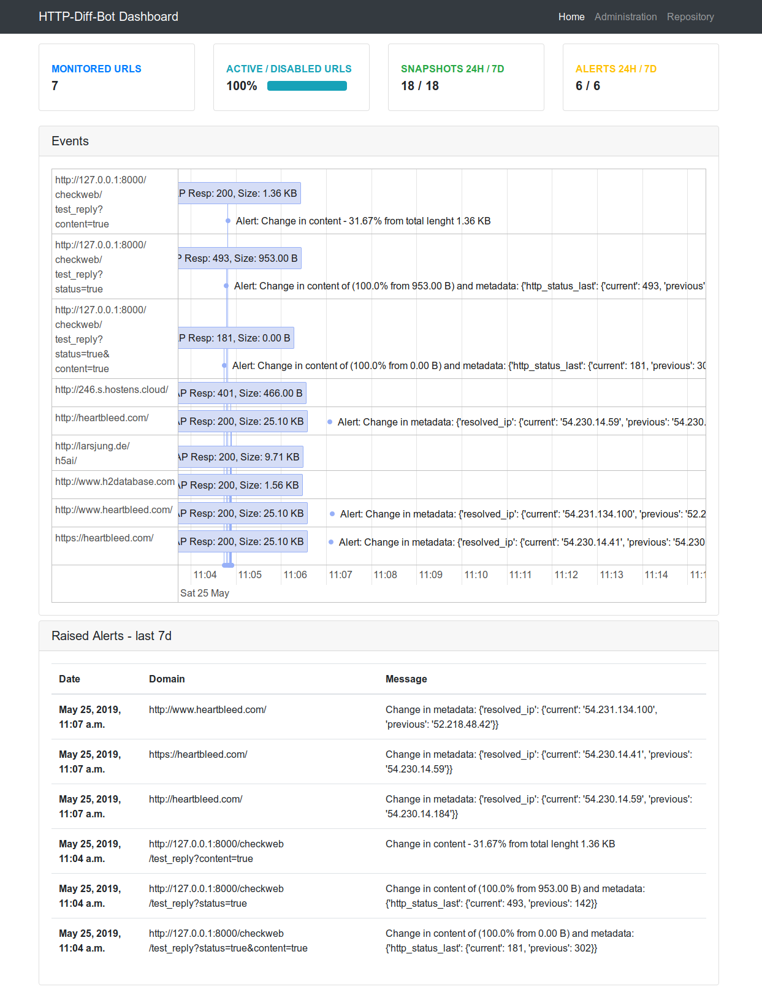

# HTTP-Diff-Bot

HTTP-Diff-Bot is Django powered application to compare and alert on changes in HTTP and HTML responses.
Simple insert URL or Domain to monitor and receive email every time a change is observed.

Features:

- Alerts by Email on following changes:
	- HTTP status code, example 200 -> 404
  - IP Address resolved for domain, example 192.168.1.2 -> 192.168.1.2
	- HTML content (within defined threshold)
- Show side-by-side comparison of HTML changes between last snapshots
- Show dashboard of snapshots and raised alerts


Screenshot - front-end dashboard


### Prerequisites

- OS: Linux (preferred), OS X or Windows
- Python >= 3.6
- Apache/Nginx  (Production Deployment Only)
- [Ruby diff-lcs library](https://rubygems.org/gems/diff-lcs)

### Installing

- Install system packages

	`sudo apt install git apache2 libapache2-mod-wsgi-py3 virtualenv sqlite3 tor rubygems snap`

- Install Ruby Diff library

	`sudo gem install diff-lcs`

- Get package
		
	`ssh-keygen -t rsa -b 4096`
	
	`ssh-add ~/.ssh/id_rsa`

	`git clone https://github.com/petermat/HTTP-Diff-Bot.git`

- Configure Python Virtual environment
	```
	virtualenv -p python3.6 venv
	source venv/bin/activate
	cd HTTP-Diff-Bot
	pip install -r requirements.txt
	```

- Deploy chrome and chromedriver  
    ```
    sudo snap install chromium    
    wget https://chromedriver.storage.googleapis.com/79.0.3945.36/chromedriver_linux64.zip (!always use latest version from https://chromedriver.chromium.org/)
    unzip chromedriver_linux64.zip 
    sudo chmod 777 chromedriver
    ```

## Production Deployment


- Reverse Apache proxy for production environment. Replace '<USER>' with name of your current user.
 
    `nano /etc/apache2/sites-available/000-default.conf`
    

    ```
    <VirtualHost *:80>
         WSGIScriptAlias / /home/<USER>/HTTP-Diff-Bot/project/wsgi.py
         WSGIDaemonProcess servername python-home=/home/<USER>/venv python-path=/home/<USER>/HTTP-Diff-Bot
         WSGIProcessGroup servername
         WSGIApplicationGroup %{GLOBAL}
    
         Alias /static/ /home/<USER>/HTTP-Diff-Bot/static/
    
         <Directory /home/<USER>/HTTP-Diff-Bot/project/>
                <Files wsgi.py>
                        Require all granted
                </Files>
         </Directory>
    
         <Directory /home/<USER>/HTTP-Diff-Bot/static >
                Require all granted
         </Directory>
    </VirtualHost>
    ```

- Verify that new apache config is valid

    `apachectl configtest`


- Add user to www-data group

	`sudo usermod -a -G www-data <USER>`


- add CRON entry for scheduled run

	`0 */8 * * * /home/myuser/venv/bin/python /home/<USER>/manage.py runner`

- set permissions for www-data log file

	`touch /home/<USER>/HTTP-Diff-Bot/debug_production.log`	
	
	`sudo chown www-data:www-data /home/<USER>/HTTP-Diff-Bot/debug_production.log`

## Getting Started

Rename file `project/local.RENAME.py` to `local.py` and edit `ALLOWED_HOSTS` and SMTP settings

    `cp project/local.RENAME.py project/local.py`

Edit file `project/local.py`:

    Change SITE_URL to your local address
    Add your local address to ALLOWED_HOSTS
    Edit Email setting part
    Add new SECRET_KEY (see line below)

    Get new SECRET KEY by running the command:
    
    `python manage.py shell -c 'from django.core.management import utils; print(utils.get_random_secret_key())'`

Collect static files for Web Server

	`python manage.py collectstatic`

Initial database structure

	`python manage.py makemigrations checkweb`
	`python manage.py migrate`


(Production only) Allow writing to DB

    `setfacl -m u:www-data:rwx /home/peter/HTTP-Diff-Bot/`

	`sudo setfacl -m u:www-data:rw /home/peter/HTTP-Diff-Bot/db.sqlite3`

Create system Superuser

	`python manage.py createsuperuser`


To fill project with test data run following:

	`python manage.py hopper`

Application is now ready to run - try local debug mode

	`python manage.py runserver`

Finally, reload apache

    `sudo systemctl reload apache2.service`

## Running the tests

Tests not implemented yet.


## License

This project is licensed under the MIT License - see the [LICENSE.md](LICENSE.md) file for details
